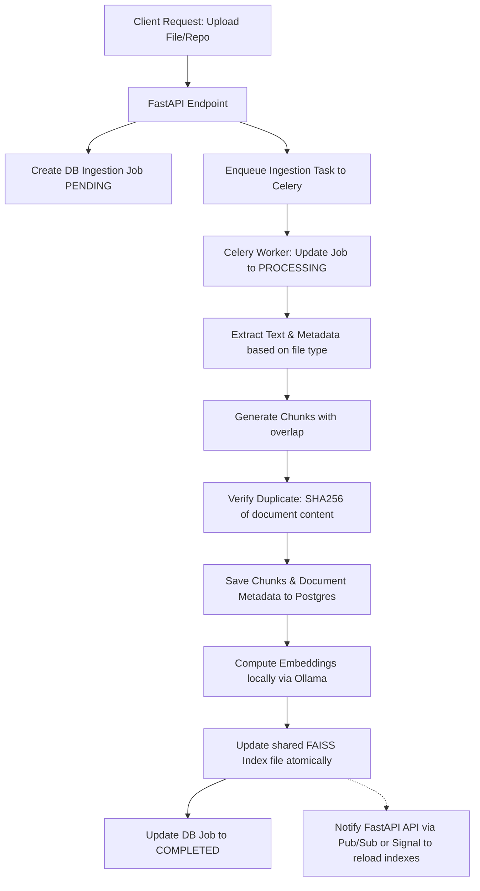
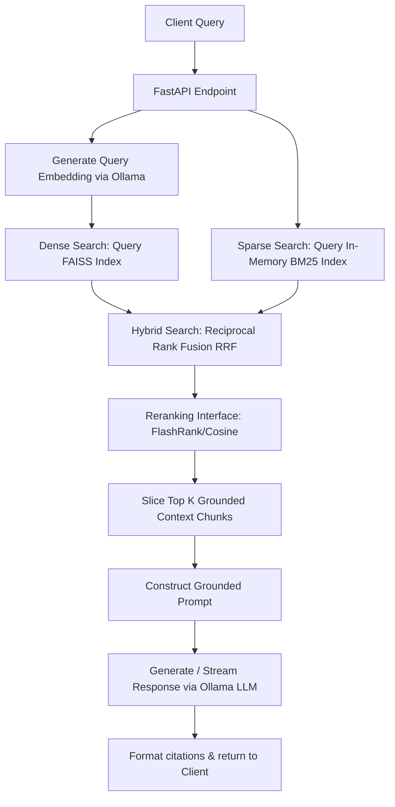

# Implementation Plan: Local RAG Knowledge Pipeline

This document describes the architectural design and implementation plan for the **Local RAG Knowledge Pipeline**.

---

## 1. Assumptions & Critical Evaluations

As a senior backend and ML systems engineer, here is a critical review of the proposed requirements:

1. **FAISS Concurrent Access (API vs. Workers):**
   * *Problem:* FastAPI processes read queries, while Celery workers ingest documents and update the vector index. Sharing a local FAISS file index between separate processes (FastAPI and Celery worker) is highly prone to file-locking issues, corruption, and race conditions.
   * *Solution:* We will store all document chunks and metadata in **PostgreSQL**. The FAISS index will be kept in a shared volume. When a Celery worker updates the FAISS index, it will save it to a temporary path and then atomically replace the active index file. The FastAPI API will check the file modification time (`mtime`) on every query (or periodically cached) and reload the FAISS index into memory if it has changed.
2. **BM25 Persistence:**
   * *Problem:* Standard Python `rank_bm25` does not have a native database or persistent store; serializing it can lead to version mismatch and synchronization bugs with PostgreSQL.
   * *Solution:* Since it is a single-server deployment, we will build/rebuild the BM25 index **in-memory** on startup by loading all chunks from PostgreSQL. When Celery finishes an ingestion job, it will notify the API (e.g., via a Redis pub/sub channel, database flag, or a simple reload endpoint) to reload the BM25 index from PostgreSQL. This guarantees 100% synchronization and robustness.
3. **Ollama Integration & GPU Passthrough:**
   * *Problem:* Running Ollama inside Docker with GPU support requires NVIDIA Container Toolkit (on Linux/Windows WSL2).
   * *Solution:* We will default our configurations to connect to `http://host.docker.internal:11434` (Ollama running on the host system), which is much easier and performs better for local GPU acceleration on Windows/macOS. We will also provide a Docker-Compose service file for containerized Ollama as an option.
4. **LangChain Value:**
   * *Problem:* Over-reliance on LangChain leads to bloated code, hard-to-debug prompts, and breaking changes.
   * *Solution:* We will use only basic document splitters/loaders from LangChain if necessary, but implement the core retrieval, RRF fusion, and generation logic in pure Python using native libraries. This keeps the codebase highly maintainable and clean.
5. **Reranker Performance:**
   * *Problem:* Running a deep Cross-Encoder model (like `ms-marco-MiniLM-L-6-v2`) on a CPU-only server for every user query will cause latency spikes (>1 second).
   * *Solution:* We will define a strict `BaseReranker` interface. By default, we will implement a `NoOpReranker` (which preserves hybrid score ordering) and a lightweight `FlashRankReranker` (using `flashrank`, a ultra-fast CPU-optimized reranking library) or a simple metadata-based heuristic. The user can toggle these in the config.

---

## 2. Final MVP Scope

* **Ingestion:** Text, Markdown, PDF (via `pypdf`/`pdfplumber`), CSV/JSON datasets, and local directory scanning (source-code repos).
* **Storage:** PostgreSQL for chunks, documents, jobs, and metadata.
* **Vector Store:** Local FAISS index (persisted to a shared volume).
* **Keyword Search:** In-memory BM25 index built from PostgreSQL.
* **Hybrid Search:** Reciprocal Rank Fusion (RRF) combining FAISS and BM25.
* **Reranker:** CPU-optimized FlashRank or Custom scoring behind a clean interface.
* **Generation:** Ollama (Llama3/Mistral/Qwen) with grounded context instructions and source citation extraction.
* **Background Tasks:** Redis + Celery for async ingestion.
* **APIs:** FastAPI with Swagger documentation, supporting streaming generation.
* **Evaluation:** Quantitative script measuring Recall@K, MRR, and response latency.

---

## 3. Proposed Folder Structure

```text
rag_pipeline/
├── app/
│   ├── __init__.py
│   ├── main.py                 # FastAPI application setup
│   ├── api/                    # API endpoints
│   │   ├── __init__.py
│   │   ├── router.py
│   │   ├── health.py
│   │   ├── documents.py
│   │   ├── query.py
│   │   └── jobs.py
│   ├── core/                   # Configuration & security
│   │   ├── __init__.py
│   │   ├── config.py
│   │   ├── security.py
│   │   └── exceptions.py
│   ├── db/                     # DB session & base model
│   │   ├── __init__.py
│   │   ├── database.py
│   │   └── base.py
│   ├── models/                 # SQLAlchemy database models
│   │   ├── __init__.py
│   │   ├── document.py
│   │   ├── chunk.py
│   │   └── job.py
│   ├── schemas/                # Pydantic schemas for API validation
│   │   ├── __init__.py
│   │   ├── document.py
│   │   ├── query.py
│   │   └── job.py
│   ├── ingestion/              # Document ingestion logic
│   │   ├── __init__.py
│   │   ├── manager.py          # Orchestrates parsing and chunking
│   │   ├── loaders.py          # Custom/adapted document loaders
│   │   └── chunking.py         # Configurable chunking strategies
│   ├── retrieval/              # Search & Retrieval logic
│   │   ├── __init__.py
│   │   ├── manager.py          # Orchestrates Hybrid Search + Reranking
│   │   ├── dense.py            # FAISS client / Ollama Embeddings
│   │   ├── sparse.py           # BM25 search
│   │   ├── fusion.py           # Reciprocal Rank Fusion (RRF)
│   │   └── reranking.py        # FlashRank / No-Op Rerankers
│   ├── generation/             # LLM Generation (Ollama)
│   │   ├── __init__.py
│   │   └── provider.py         # Prompt crafting & Ollama API integration
│   └── workers/                # Celery worker tasks
│       ├── __init__.py
│       ├── celery_app.py
│       └── tasks.py
├── tests/                      # Automated test suite
│   ├── __init__.py
│   ├── conftest.py
│   ├── test_ingestion.py
│   ├── test_retrieval.py
│   └── test_api.py
├── evaluation/                 # Retrieval and generation evaluation
│   ├── __init__.py
│   ├── dataset.json
│   └── evaluate.py
├── docker-compose.yml
├── Dockerfile
├── requirements.txt
├── README.md
└── .env.example
```

---

## 4. Database Schema

We will use SQLAlchemy and PostgreSQL. Three primary tables are required:

### `documents`
Stores document-level metadata.
* `id`: UUID (Primary Key)
* `source_name`: String (e.g. filename, repository name)
* `source_type`: String (e.g. "pdf", "repo", "csv")
* `file_path`: String (absolute or relative path)
* `file_hash`: String (SHA-256 for duplicate detection)
* `created_at`: DateTime
* `updated_at`: DateTime

### `document_chunks`
Stores the individual chunks of text extracted from documents.
* `id`: UUID (Primary Key)
* `document_id`: UUID (Foreign Key to `documents.id` ON DELETE CASCADE)
* `text_content`: Text
* `chunk_index`: Integer (sequence number)
* `page_number`: Integer (optional)
* `section_title`: String (optional)
* `repo_relative_path`: String (optional)
* `record_id`: String (optional, for CSV/JSON rows)
* `metadata`: JSONB (catch-all for extra info)

### `ingestion_jobs`
Tracks Celery asynchronous jobs.
* `id`: UUID (Primary Key)
* `status`: String (PENDING, PROCESSING, COMPLETED, FAILED)
* `source_name`: String
* `error_message`: Text (optional)
* `created_at`: DateTime
* `updated_at`: DateTime

---

## 5. API Contract (Summary)

* `GET /health` -> Health check (Service up)
* `GET /ready` -> Readiness check (DB connection + Ollama connection verified)
* `POST /documents/upload` -> Multipart file upload. Returns `job_id`.
* `POST /repositories/index` -> Indexes a local directory folder. Returns `job_id`.
* `POST /datasets/upload` -> Uploads CSV/JSON dataset. Returns `job_id`.
* `GET /documents` -> Lists ingested documents.
* `GET /documents/{document_id}` -> Retrieves a specific document's metadata.
* `DELETE /documents/{document_id}` -> Deletes document, chunks, and schedules index update.
* `POST /documents/{document_id}/reindex` -> Triggers re-indexing of a document. Returns `job_id`.
* `GET /jobs/{job_id}` -> Returns status and metadata of background job.
* `POST /query` -> JSON body query. Returns answer, retrieved context chunks, and citations.
* `POST /query/stream` -> Streams generation tokens via Server-Sent Events (SSE).

---

## 6. Ingestion & Retrieval Flows

### Ingestion Flow


### Retrieval Flow


---

## 7. Phased Implementation Roadmap

### Phase 1: Foundation (Goal: Runnable REST API with DB)
* Set up Docker Compose: PostgreSQL, Redis, API container.
* Configure typed settings (`Pydantic-settings`).
* Establish SQLAlchemy schemas, migrations, database session lifecycle.
* Create `/health` and `/ready` endpoints.
* Implement API Key middleware.

### Phase 2: Ingestion & Parsing (Goal: Read and Chunk files)
* Implement parsing loaders: plain text, Markdown, PDF.
* Build configurable chunking strategy (`RecursiveCharacterTextSplitter` logic).
* Create synchronous upload endpoint to verify parsing works.
* Implement SHA-256 duplicate checking.

### Phase 3: Dense Retrieval (Goal: Local embeddings & FAISS)
* Integrate Ollama Embeddings client.
* Set up local FAISS index structure (save/load from shared volume).
* Implement index reload logic on file changes.
* Build dense search query routing.

### Phase 4: Sparse & Hybrid Retrieval (Goal: BM25 + RRF)
* Set up `rank-bm25` in-memory module.
* Build pipeline to pull chunks from DB and update the BM25 index.
* Implement RRF (Reciprocal Rank Fusion) algorithm to merge dense and sparse results.

### Phase 5: Grounded Generation (Goal: Response + Citations)
* Integrate Ollama LLM client.
* Craft grounded RAG prompts ensuring model sticks strictly to context.
* Implement generation citations parsing (e.g. tracking sources from context chunks).
* Add streaming endpoint (`/query/stream`) using SSE.

### Phase 6: Asynchronous Ingestion (Goal: Celery & Redis)
* Add Celery worker to Docker Compose.
* Refactor document ingestion endpoints to return a `job_id` and run async.
* Connect database job tracking table with status updates.

### Phase 7: Advanced Ingestion (Goal: Repositories & Structured Data)
* Implement local directory scan (source-code parser preserving relative paths).
* Implement CSV/JSON dataset parser mapping row numbers to record IDs.

### Phase 8: Reranking & Evaluation (Goal: Quantifiable Metrics)
* Define Reranking interface and implement FlashRank.
* Build evaluation dataset (`dataset.json`) and run metrics test script comparing Hybrid, Dense-only, and BM25-only.

### Phase 9: Hardening & Testing (Goal: Unit tests & Production configuration)
* Add Pytest suite covering critical paths (parsing, fusion, citation).
* Set up rate limiting, security headers, file-upload restrictions.
* Document deployment, API curls, backup strategies, and design trade-offs.

---

## 8. Verification Plan

### Automated Verification
* Unit tests using `pytest` and an in-memory/isolated SQLite/Postgres DB.
* Integration test script executing the entire pipeline (Ingest -> Search -> Retrieve -> Generate).
* Evaluator script measuring Recall@K and latency metrics.

### Manual Verification
* Swagger UI interactive exploration (`/docs`).
* `curl` commands testing stream outputs and job statuses.
